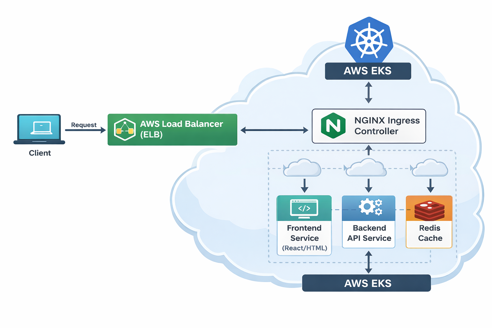
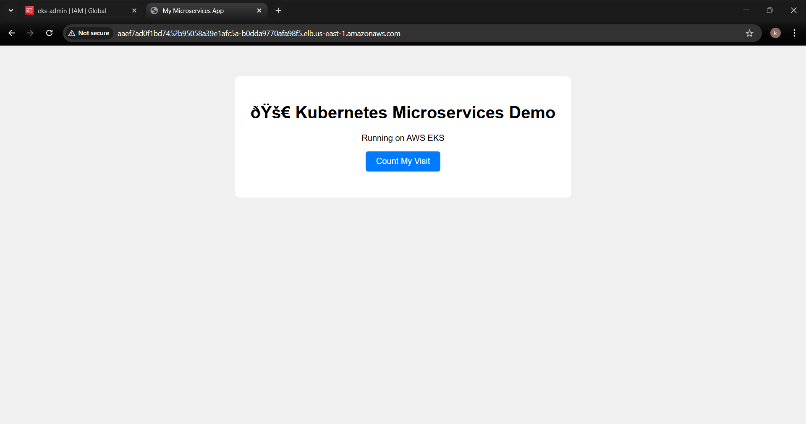

# 🚀 Kubernetes Microservices Deployment on AWS EKS




A **production-style microservices deployment** on **AWS Elastic Kubernetes Service (EKS)** using Docker, Kubernetes, Helm, Redis, Horizontal Pod Autoscaling, and NGINX Ingress.

This project demonstrates how containerized services can be deployed and scaled on a Kubernetes cluster running in AWS.

---

# 🌐 Live Demo

The application was deployed on AWS Elastic Kubernetes Service (EKS) with a production-style architecture.

Deployment components included:

- AWS EKS cluster
- Managed node group (EC2 instances)
- NGINX Ingress Controller
- AWS LoadBalancer (ELB)
- Helm-based application deployment

External traffic was routed through the AWS LoadBalancer to the Kubernetes Ingress controller, which then forwarded requests to the frontend and backend services.

Due to AWS infrastructure costs, the cluster is not kept running continuously. However, the project can be redeployed using the steps provided in the Deployment section.

---
## 📸 Application Preview

---

# 🧰 Tech Stack

* AWS EKS
* Kubernetes
* Docker
* Helm
* NGINX Ingress Controller
* Redis
* Horizontal Pod Autoscaler
* AWS LoadBalancer (ELB)

---

# 🏗 Architecture

The application follows a **microservices architecture** deployed on AWS EKS.

### Request Flow

```
Client
   ↓
AWS Load Balancer (ELB)
   ↓
NGINX Ingress Controller
   ↓
Frontend Service
   ↓
Backend API Service
   ↓
Redis Cache
```

### Architecture Components

**AWS Load Balancer (ELB)**
Receives external traffic and forwards it to the Kubernetes cluster.

**NGINX Ingress Controller**
Acts as the entry point for HTTP traffic and routes requests to Kubernetes services.

**Frontend Service**
Provides the user interface and communicates with backend APIs.

**Backend API Service**
Handles application logic and interacts with Redis.

**Redis Cache**
Stores visit counts and improves application performance.

**AWS EKS**
Manages Kubernetes worker nodes and orchestrates containerized workloads.

---

# 📂 Project Structure

```
backend/              Backend API service
frontend/             Frontend application
helm-charts/myapp/    Helm chart for deployment
assets/               Architecture diagrams
ingress.yaml          Kubernetes ingress configuration
README.md             Project documentation
```

---

# ⚙ Deployment

### 1️⃣ Create EKS Cluster

```bash
eksctl create cluster \
--name microservices-cluster \
--region us-east-1
```

---

### 2️⃣ Deploy Application using Helm

```bash
helm install myapp ./helm-charts/myapp -n microservices-prod
```

---

### 3️⃣ Install NGINX Ingress Controller

```bash
kubectl apply -f https://raw.githubusercontent.com/kubernetes/ingress-nginx/main/deploy/static/provider/aws/deploy.yaml
```

---

### 4️⃣ Verify Deployment

```bash
kubectl get pods -n microservices-prod
kubectl get ingress -n microservices-prod
```

---

### 5️⃣ Access Application

Open the AWS LoadBalancer URL in your browser.

---

# 📊 Features

* Microservices architecture
* Containerized services using Docker
* Kubernetes orchestration on AWS EKS
* Helm-based deployment
* NGINX ingress routing
* Redis caching layer
* Horizontal Pod Autoscaling
* Scalable cloud infrastructure

---

# 🔮 Future Improvements

* CI/CD pipeline with GitHub Actions
* Monitoring using Prometheus and Grafana
* Centralized logging with ELK Stack
* Infrastructure as Code using Terraform

---

# 👩‍💻 Author

**Krishna**

GitHub
https://github.com/krishnash648

---

# ⭐ If you found this project useful, consider giving it a star.
